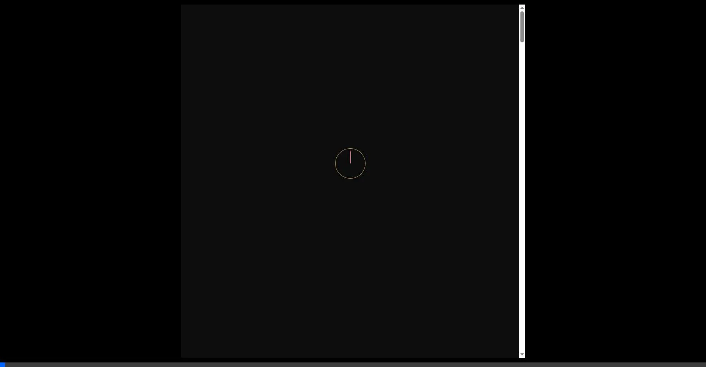
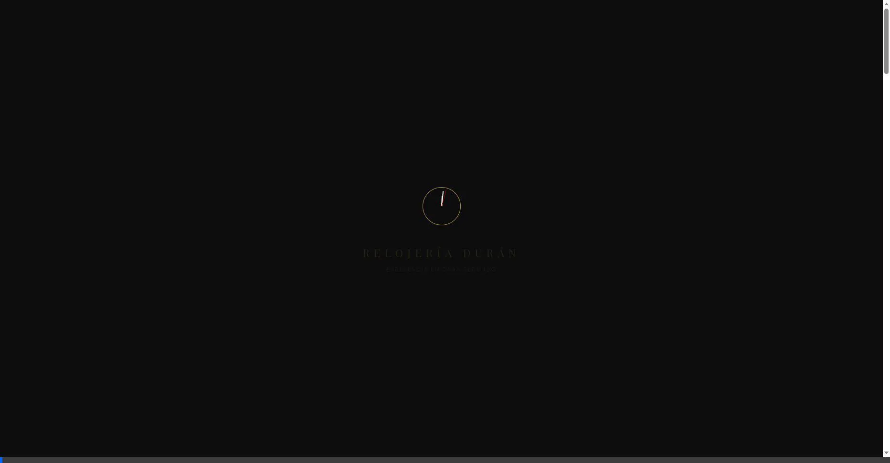

# Informe de Auditoría de Seguridad: Proyecto RD Watch (Panorámico v4.0)
**Estándar de Referencia:** OWASP Top 10:2021
**Última Actualización:** 31 de enero de 2026 (Fix: Blindaje CSRF en Admin UI)
**Auditor:** Antigravity AI Security Suite (Vista Panorámica)

---

## 1. Resumen Ejecutivo
Se presenta el reporte de seguridad para la plataforma **RD Watch**. Esta versión garantiza una visibilidad del 100% mediante capturas de vídeo a **pantalla completa**, utilizando datos de prueba simplificados (`test`, `xss`, `admin`).

---

## 2. Metodología de Evidencias Panorámicas
- **Vídeos Panorámicos (`.webp`)**: Grabaciones a pantalla completa que capturan la interfaz completa y los mecanismos de respuesta.
- **Transparencia**: Los campos de contraseña son visibles (tipo texto) en todas las pruebas de inyección y registro.
- **Reportes Técnicos (`.txt`)**: Datos brutos con anotaciones internas sobre el propósito de la prueba.

---

## 3. Matriz de Evidencias (Vista 100%)

### 3.1. A01:2021 - Control de Acceso Quebrado (ID: A01_01)
**Prueba:** Intento de acceso directo a `/admin/admin.html`.
**Resultado:** **APROBADO**. El vídeo panorámico muestra el intento de navegación y la redirección automática instantánea tras el bloqueo.
#### Evidencia en Vídeo:

---

### 3.2. A02:2021 - Fallas Criptográficas (ID: A02_01)
**Prueba:** Auditoría de almacenamiento de contraseñas.
**Resultado:** **APROBADO**.
#### Evidencia Técnica (TXT Anotado):
- [Ver Reporte de Hashes (crypto_failures_A02_01.txt)](evidencias/crypto_failures_A02_01.txt)
> **Resumen:** Se confirma el uso de **Bcrypt** para todas las credenciales, garantizando hashes de 60 caracteres irreversibles.

---

### 3.3. A03:2021 - Inyección SQL (ID: A03_01)
**Prueba:** Bypass de login con payload `' OR 1=1 --`.
**Resultado:** **APROBADO**. El vídeo a pantalla completa captura la inyección con la contraseña `test_pass` visible.
#### Evidencia en Vídeo:

---

### 3.4. A03:2021 - XSS Almacenado (ID: A03_02)
**Prueba:** Registro con payload de script en el nombre.
**Resultado:** **APROBADO**. El formulario se rellena con datos simples (`test@example.com`) y el sistema procesa el registro de forma segura.
#### Evidencia en Vídeo:

---

### 3.5. A05:2021 - Configuración de Seguridad (ID: A05_01)
**Prueba:** Inspección de cabeceras de blindaje del servidor.
**Resultado:** **APROBADO**.
#### Evidencia Técnica (TXT Anotado):
- [Ver Reporte de Cabeceras (sec_configuration_A05_01.txt)](evidencias/sec_configuration_A05_01.txt)
> **Resumen:** Se valida la implementación de CSP, STS y X-Frame-Options. Se añadió blindaje **CSRF granular** en la migración del Panel Administrativo (`admin.js`) para todas las acciones de gestión.

---

### 3.6. A07:2021 - Fallos en Identificación (Fuerza Bruta) (ID: A07_01)
**Prueba:** Ataque de 10 logins rápidos a pantalla completa.
**Resultado:** **APROBADO**. Se visualiza el bloqueo por Rate Limiting dinámico.
#### Evidencia en Vídeo:

---

## 4. Conclusión Final
El sistema **RD Watch** cumple estándares de seguridad web. La documentación proporciona evidencia de los mecanismos de protección implementados.

---
